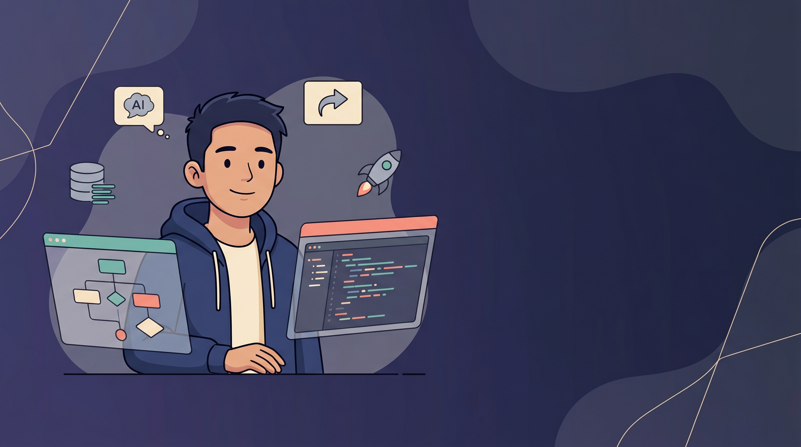

# 👋 Hi, I'm Rex

**I build automation that actually ships.** Production AI pipelines, full-stack web apps, mobile — wherever the problem lives, that's the stack I reach for.

ased in the Philippines, working globally.

📧 [owenquintenta@gmail.com](mailto:owenquintenta@gmail.com) &nbsp;·&nbsp; 💼 [LinkedIn](https://linkedin.com/in/owendev) &nbsp;·&nbsp; 🧑‍💻 [Upwork](https://www.upwork.com/freelancers/~016d94e91b51fc9dec)

---

## What I've built

### AI Content Pipeline

Six interconnected n8n workflows — keyword → AI draft → quality eval → WordPress publish. Editors only touch the approval step.

**$20/month replaces 80 hours/week of editorial work.** 6,800+ runs/month.
→ [github.com/RexOwenDev/ai-content-pipeline](https://github.com/RexOwenDev/ai-content-pipeline)

---

### Recruitment Pipeline

Candidate submits a form → Claude scores across 3 dimensions → CRM updated → team alerted → personalized email sent → audit log written. Offers need a human thumbs-up; AI never auto-sends.

**Under 10 seconds per candidate.**
→ [github.com/RexOwenDev/recruitment-pipeline](https://github.com/RexOwenDev/recruitment-pipeline)

---

### KnowledgeBase AI

Enterprise RAG with hybrid BM25 + vector search, cross-encoder reranking, inline citations, async faithfulness evaluation, and multi-tenant workspace isolation.

**~75 hours/week recovered at 100 employees.**
→ [github.com/RexOwenDev/rag-chat-app](https://github.com/RexOwenDev/rag-chat-app)

---

## More on the workbench

| Repo | What it does |
|---|---|
| [**autoflow-studio**](https://github.com/RexOwenDev/autoflow-studio) | Reference multi-tenant SaaS — 8 gated phases, 120 Vitest + 45 pgTAP assertions, SOC2-aligned audit |
| [**saas-billing-starter**](https://github.com/RexOwenDev/saas-billing-starter) | Production-ready Stripe billing — plan tiers, usage metering, customer portal, webhooks |
| [**seobot**](https://github.com/RexOwenDev/seobot) | AI SEO content pipeline — keyword → SEO article → publish to WordPress/Shopify |
| [**employee-onboarding-pipeline**](https://github.com/RexOwenDev/employee-onboarding-pipeline) | 10-workflow n8n automation — BambooHR to GSuite/Slack/Notion, zero IT tickets per hire |
| [**proposal-studio**](https://github.com/RexOwenDev/proposal-studio) | AI-powered collaborative proposal editor — real-time sync, client accept, full audit trail |
| [**content-factory**](https://github.com/RexOwenDev/content-factory) | Multi-market AI content in 12 languages — Claude + DeepL transcreation with LLM-as-judge QA |

---

## Stack

- **Automation** — n8n Cloud · Python · Node.js · webhooks · HMAC-SHA256 · cron
- **AI** — Claude (Anthropic) · GPT-4.1-mini · Cohere Rerank 3 · OpenAI Embeddings · RAG
- **Web** — Next.js 16 · React 19 · TypeScript · Tailwind v4 · shadcn/ui
- **Mobile** — React Native · Expo — cross-platform iOS & Android
- **Backend** — Supabase · PostgreSQL · pgvector · Inngest · Vercel

> I work with **Claude Code** — the constraint isn't language familiarity, it's the problem itself.

---

## Right now

Building out `autoflow-studio` as a reference multi-tenant SaaS and shipping a lead-enrichment API. **Open to:** freelance AI automation · full-stack contracts · enterprise roles.

---

**Let's talk** → 📧 [owenquintenta@gmail.com](mailto:owenquintenta@gmail.com) &nbsp;·&nbsp; 💼 [LinkedIn](https://linkedin.com/in/owendev) &nbsp;·&nbsp; 🧑‍💻 [Upwork](https://www.upwork.com/freelancers/~016d94e91b51fc9dec)
